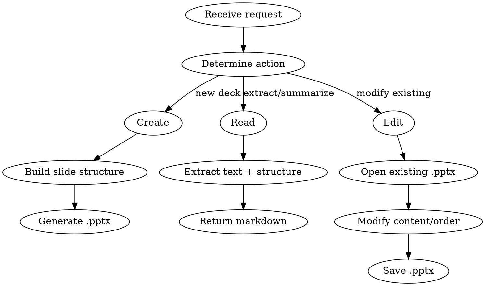

# PPTX Skill

## Overview

Create, read, edit, and analyze PowerPoint presentations with BMW Corporate Identity branding. Uses `python-pptx` exclusively -- no LibreOffice, Poppler, or Node.js dependencies. Works on macOS, Linux, and Windows.

## Quick Reference

| Task | How |
|------|-----|
| Create BMW-branded deck | `bmw-pptx create output.pptx --slides slides.json` |
| Read/extract text | `bmw-pptx read presentation.pptx` |
| Read with full metadata | `bmw-pptx read presentation.pptx --verbose` |
| List layouts in template | `bmw-pptx list-layouts` |
| Edit slide content | `bmw-pptx edit presentation.pptx --slide 2 --title "New Title"` |
| Delete slides | `bmw-pptx edit presentation.pptx --delete 3,5,7` |
| Reorder slides | `bmw-pptx edit presentation.pptx --reorder 3,1,2,4` |
| Duplicate a slide | `bmw-pptx edit presentation.pptx --duplicate 2` |
| Add slides to existing deck | `bmw-pptx add-slides deck.pptx --slides new.json` |
| Create from Python | Read [references/python-pptx.md](references/python-pptx.md) |

For BMW colors, layouts, and API: [references/bmw-ci.md](references/bmw-ci.md).

## Style Selection (Registry-Aware)

**Before building a new deck, always resolve the style to use.** Read existing presentations / edit tasks skip this step.

### Step 1 — Query the registry
```bash
python ~/.config/opencode/ppt-styles/list_styles.py --menu
```
This outputs the exact menu to show the user, with live registry data.

### Step 2 — Present the style menu
Copy the output of `list_styles.py --menu` verbatim to the user. It will look like:
```
🎨 Which presentation style would you like to use?

  1. BMW CI [default] — #035970, BMWGroupTN Condensed  [BMW Group standard, light backgrounds]
  2. <Name> — <primary_color>, <font>  [<tags>]
  ...

   Press Enter or type "1" for the default, or pick a number / name.
   Have a .pptx not listed? Share its path and I'll clone it first.
```

### Step 3 — Resolve the selection
| Input | Action |
|-------|--------|
| Empty / "1" / "BMW CI" / "default" | Use BMW CI built-in styling (current behavior) |
| Number or name matching registry | Load `<style_dir>/brand-guide.md` + `style.json` |
| New `.pptx` file path provided | Run `clone_style.py` first, then use new style |

### Step 4 — Apply the resolved style
- **BMW CI:** Use the `BMW` color constants and `BmwPresentation` API as documented below.
- **Any registry style:** Read `<style_dir>/brand-guide.md` (CI anchor + color/font rules) and `<style_dir>/style.json`. Use `typography_summary.primary_color` as the primary fill color; `theme_summary.major_font` for all title/heading text; `theme_summary.minor_font` for body text.
- **Font family constraint (all styles):** Only BMW Group typefaces are permitted — `BMWGroupTN Condensed`, `BMW Group Condensed`, or `BMW Group`. Never substitute Arial, Calibri, or other system fonts. Check `brand-guide.md` → "Font Family Rule" section for the specific variant active in each style.

---

## When to Use

- User asks to "create a deck", "make slides", "build a presentation"
- User provides a `.pptx` file and asks to read, summarize, or modify it
- User wants BMW-branded slides from structured content (meeting notes, Jira data, reports)
- User mentions "deck", "slides", "presentation", or `.pptx` in their request

## When NOT to Use

- User wants a PDF report -- use a markdown-to-PDF workflow instead
- User wants to create diagrams/charts only -- use PlantUML or Mermaid
- User wants to edit a `.pptx` at the raw XML level -- this skill uses the python-pptx object API

## Workflow



## Implementation

### Creating a New Deck

**Option A -- CLI (structured JSON input):**

Define slides as JSON, then run:

```bash
bmw-pptx create output.pptx --slides /tmp/slides.json
```

Where `slides.json` is:

```json
[
  {"type": "title", "title": "Q2 Status Report", "subtitle": "Month Year"},
  {"type": "divider", "title": "Key Metrics"},
  {"type": "content", "title": "Revenue", "body": ["Up 12% YoY", "EMEA strongest region"]},
  {"type": "two_column", "title": "Comparison", "left": ["Item A", "Item B"], "right": ["Result A", "Result B"]},
  {"type": "keynote", "title": "Ship it."}
]
```

Supported slide types: `title`, `divider`, `content`, `two_column`, `grid`, `keynote`, `table`.

**Table slide type:**

```json
[
  {
    "type": "table",
    "title": "Comparison Matrix",
    "rows": [
      ["Feature", "Option A", "Option B"],
      ["Speed", "Fast", "Slow"],
      ["Cost", "$10", "$50"]
    ]
  }
]
```

The `table` type creates a grid layout slide with a BMW-styled table (dark teal header, striped rows, BMW font).

**Option B -- Python script (advanced):**

```python
import sys
sys.path.insert(0, "<TOOLKIT_ROOT>/tools/pptx")
from bmw_pptx import BmwPresentation, BMW, set_font

bmw = BmwPresentation()
bmw.add_title_slide("Q2 Report", subtitle="Month Year")
slide = bmw.add_grid_slide("Custom Layout")
# Add shapes directly via python-pptx API
from pptx.util import Inches, Pt
from pptx.enum.shapes import MSO_SHAPE
shape = slide.shapes.add_shape(MSO_SHAPE.ROUNDED_RECTANGLE, Inches(1), Inches(2), Inches(3), Inches(2))
shape.fill.solid()
shape.fill.fore_color.rgb = BMW.MEDIUM_BLUE
set_font(shape.text_frame, size=14, color=BMW.WHITE)
bmw.save("output.pptx")
```

See [references/bmw-ci.md](references/bmw-ci.md) for all colors, layouts, and helper methods.

### Reading/Extracting Content

```bash
# Basic text extraction
bmw-pptx read presentation.pptx

# Verbose: includes speaker notes, placeholder metadata, image info, table structure, deck dimensions
bmw-pptx read presentation.pptx --verbose
```

Returns markdown with slide numbers, titles, and all text content. Use this to:
- Summarize an existing deck
- Extract action items from a presentation
- Understand structure before editing
- Audit placeholder usage and image inventory (verbose mode)

### Editing an Existing Deck

```bash
# Change slide 2 title and body
bmw-pptx edit deck.pptx --slide 2 --title "Updated Title" --body "New content"

# Delete slides 3 and 5
bmw-pptx edit deck.pptx --delete 3,5

# Reorder: move slide 4 to position 1
bmw-pptx edit deck.pptx --reorder 4,1,2,3,5

# Duplicate slide 2 (appended at end)
bmw-pptx edit deck.pptx --duplicate 2

# Save to a different file
bmw-pptx edit deck.pptx --slide 2 --title "New" --output modified.pptx
```

### Adding Slides to an Existing Deck

```bash
# Append slides from JSON to an existing deck
bmw-pptx add-slides deck.pptx --slides additional_slides.json

# Save to a different file instead of overwriting
bmw-pptx add-slides deck.pptx --slides additional_slides.json --output extended.pptx
```

The `add-slides` command uses the same JSON format as `create`. It opens the existing deck and appends new slides.

## JSON CLI vs Python Script -- Decision Matrix

| Scenario | Use JSON CLI | Use Python script |
|----------|:-----------:|:-----------------:|
| Standard slides (title, content, bullets, tables) | **Yes** | |
| Custom visual layouts (cards, architecture diagrams, icon grids) | | **Yes** |
| Stat callouts, big-number slides | | **Yes** |
| Custom positioning of multiple shapes on one slide | | **Yes** |
| Arrows, connectors, layered elements | | **Yes** |
| Quick deck from structured data | **Yes** | |
| Programmatic data-driven charts + tables | | **Yes** |

**Rule of thumb:** If every slide maps cleanly to a supported type (`title`, `divider`, `content`, `two_column`, `grid`, `keynote`, `table`), use JSON CLI. If you need custom shape placement, multiple text boxes, or visual layouts that go beyond placeholders, write a Python script using the `bmw_pptx` module.

## Helper Functions (Python API)

When writing Python scripts, these helpers from `bmw_pptx` simplify common visual patterns:

| Helper | Purpose |
|--------|---------|
| `add_text_box(slide, text, left, top, w, h, ...)` | Styled text box with BMW font |
| `add_card(slide, left, top, w, h, title, body, ...)` | Rounded card with title + body |
| `add_styled_table(slide, data, ...)` | BMW-themed table with header + stripes |
| `add_arrow(slide, left, top, w, h, direction, ...)` | Directional arrow shape |
| `add_icon_circle(slide, text, left, top, ...)` | Colored circle with centered icon/emoji |
| `add_shape(slide, type, left, top, w, h, ...)` | Generic auto-shape |
| `add_table(slide, rows, cols, data, ...)` | Basic table (no stripes) |
| `add_chart(slide, type, categories, series, ...)` | Chart (bar, line, pie, etc.) |
| `set_font(target, size, bold, color, ...)` | Apply BMW font to any text element |

## Dependencies

- **`python-pptx`** must be installed: `pip install python-pptx`
- No other external dependencies (no LibreOffice, Poppler, Node.js, etc.)
- The BMW template (`.pptx` file) is bundled in `tools/pptx/assets/`
- When writing Python scripts, import from the tool path:
  ```python
  import sys
  sys.path.insert(0, "<TOOLKIT_ROOT>/tools/pptx")
  from bmw_pptx import BmwPresentation, BMW, set_font, add_card, add_styled_table
  ```

## Design Rules

When generating presentations, follow these principles:

1. **No boring slides.** Every slide needs a visual element -- icon, shape, chart, or image.
2. **Topic-matched palette.** One dominant color (60-70%), 1-2 supporting, one accent. Never equal weight.
3. **Dark/light sandwich.** Dark backgrounds for title + closing, light for content.
4. **One visual motif.** Pick a distinctive element (colored circles, thick borders, rounded cards) and repeat it.
5. **Vary layouts.** Never repeat the same layout back-to-back. Mix columns, grids, callouts.
6. **Left-align body text.** Center only titles and key messages.
7. **Size contrast.** Titles 36pt+, body 14-16pt, captions 10-12pt.
8. **Icons: Unicode in colored shapes** (star, lightning, checkmark in `OVAL` shapes).
9. **No accent lines under titles** -- hallmark of AI-generated slides.
10. **Text contrast is non-negotiable.** The BMW palette is blue-heavy. Many color combinations look similar and produce unreadable text. Follow the safe pairings below strictly.

### Text Contrast -- Safe Pairings

The BMW theme is almost entirely blues and teals. Using blue text on blue backgrounds is the #1 readability mistake. **Always verify text is readable against its background.**

| Background | Safe text colors | NEVER use as text |
|------------|-----------------|-------------------|
| Dark/teal backgrounds, gradients, `DARK_TEAL` | `WHITE`, `SUBTLE_BG`, `STRIPE_BG` | `LIGHT_BLUE`, `MEDIUM_BLUE`, `SOFT_BLUE`, `SECONDARY` |
| `WHITE`, `STRIPE_BG`, `SUBTLE_BG` (light) | `BLACK`, `DARK_TEAL` | `SECONDARY`, `SOFT_BLUE`, `CARD_BG` |
| `CARD_BG`, `SOFT_BLUE` (mid-tone) | `BLACK`, `DARK_TEAL` | `SECONDARY`, `WHITE` |
| `LIGHT_BLUE`, `MEDIUM_BLUE` (accent fills) | `WHITE`, `BLACK` | `DARK_TEAL`, `SOFT_BLUE` |

**Rule of thumb:** On any dark or blue/teal background, text must be `WHITE` or near-white (`SUBTLE_BG`, `STRIPE_BG`). On any light background, text must be `BLACK` or `DARK_TEAL`. Never use mid-range blues (`LIGHT_BLUE`, `MEDIUM_BLUE`, `SOFT_BLUE`, `SECONDARY`) as text on dark or blue backgrounds -- they disappear.

## Error Handling

| Error | Response |
|-------|----------|
| `python-pptx` not installed | `pip install python-pptx` -- no other deps needed |
| Template not found | Tool auto-locates template relative to its install path |
| Slide index out of range | Clear error: "Slide N does not exist (deck has M slides)" |
| Invalid JSON input | Validate and report which field is wrong |
| Empty presentation | "No slides found in [file]" |

## Related Skills

- `confluence-docs` -- for publishing content to Confluence instead of PowerPoint
- `meeting-recording` -- record and transcribe meetings; output can be turned into slides
